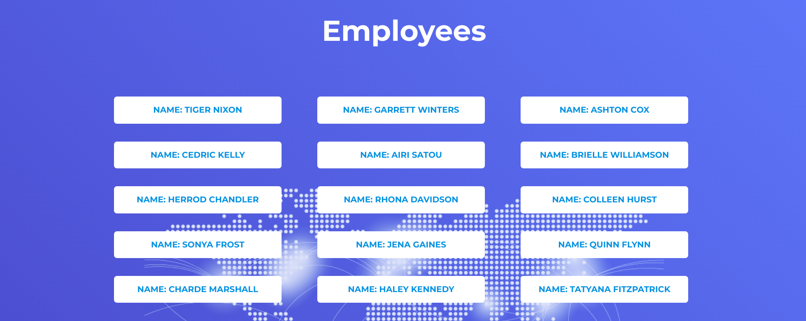
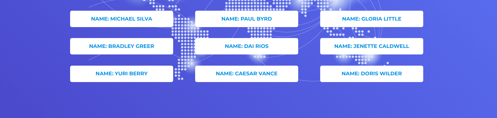
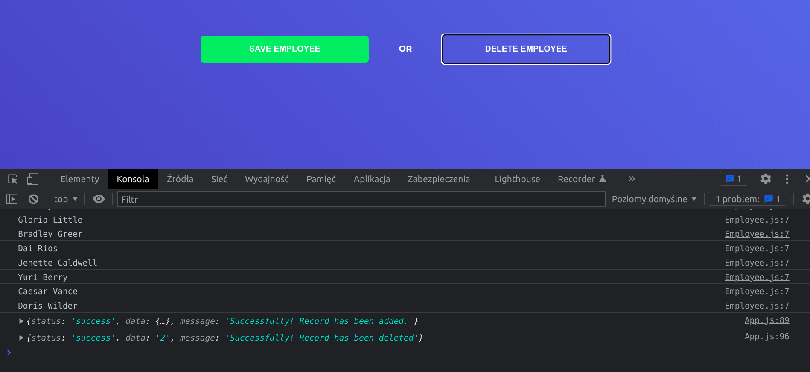

# Emplyee-App

> Final defense project

## Table of contents

* [General info](#general-info)
* [Screenshots](#screenshots)
* [Technologies Used](#technologies-used)
* [Features](#features)
* [Setup](#setup)
* [Project Status](#project-status)
* [Room for Improvement](#room-for-improvement)
* [Acknowledgements](#acknowledgements)
* [Contact](#contact)

## General info

The aim of the project is to create service for the test rest server   
that will communicate with endpoints, to the appropriate paths by sending GET, POST, PUT, DELETE requests, 
 it will receive a JSON list of employees from the application level, 
 using the Fetch API interface

## Screenshots

## Technologies Used

- JavaScript
- React - version 18.0.0 
- Fetch API
- SASS
- Block__Element--Modifier (BEM)
- HTML 5.1
- ITCSS (organizational issues, layered structure)

## Features

- Functionally written components
- Hook useEffect, useState
- Displaying lists downloaded from edpoint paths

## Setup

This project was bootstrapped with [Create React App]

## Available Scripts

In the project directory, you can run:

### `npm start`

Runs the app in the development mode.
Open http://localhost:3000 to view it in the browser.

The page will reload if you make edits.
You will also see any lint errors in the console.

### `npm run build`

Builds the app for production to the `build` folder.\
It correctly bundles React in production mode and optimizes the build for the best performance.

The build is minified and the filenames include the hashes.\
Your app is ready to be deployed!

## Project Status

Project is: _in progress_

## Room for Improvement

List of features ready and TODOs for future development

- Layout of the main page with the addition of a subpage
- Adding quick buttons
- Optimisation

## Acknowledgements

 -My person adopted asynchronous javascript, inspired by "https://jsonplaceholder.typicode.com/" thanks to which I worked on Fetch API
- Many thanks to lecturer Ksawery Kargól from "strefakursow.pl" on course "Kurs Programowanie asynchroniczne w JavaScript"

## Contact

Created by Krystian Marciniak krystianmarciniak446@gmail.com - feel free to contact me!
